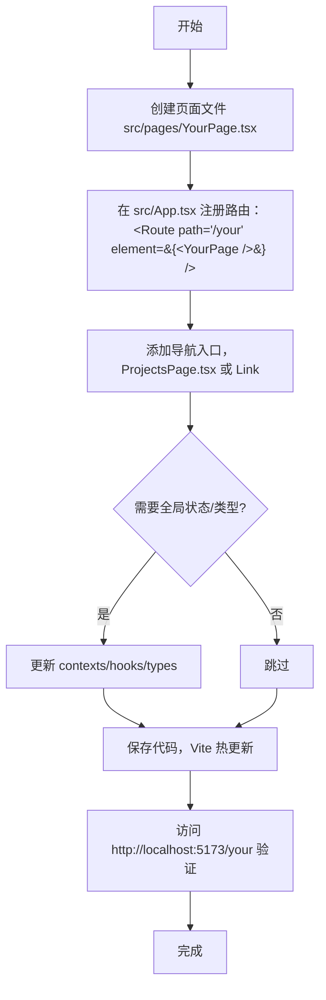

```mermaid
graph TD;
    A-->B;
    A-->C;
    B-->D;
    C-->D;
```

```mermaid
graph TD;
  A[开始] --> B[创建页面文件 src/pages/YourPage.tsx]
  B --> C["在 src/App.tsx 注册路由：&lt;Route path='/your' element=&#123;&lt;YourPage /&gt;&#125; /&gt;"]
  C --> D[添加导航入口，ProjectsPage.tsx 或 Link]
  D --> E{需要全局状态/类型?}
  E -->|是| F[更新 contexts/hooks/types]
  E -->|否| G[跳过]
  F --> H[保存代码，Vite 热更新]
  G --> H
  H --> I[访问 http://localhost:5173/your 验证]
  I --> J[完成]
```