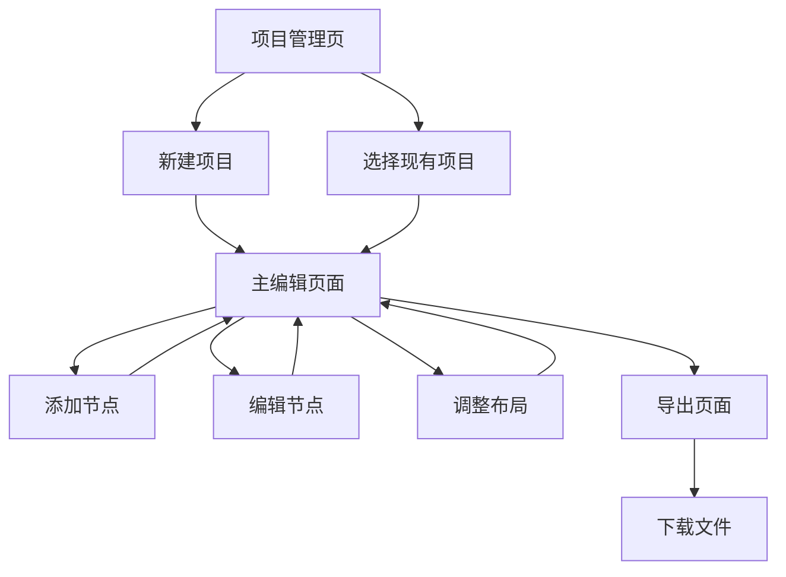

# 思维导图应用产品需求文档

## 1. Product Overview
一个基于 React 和 xyflow 的现代化思维导图应用，帮助用户创建、编辑和管理思维导图，提升思维整理和知识管理效率。
- 解决用户在思维整理、项目规划、知识梳理等场景中的可视化需求，让复杂的思维结构变得清晰直观。
- 面向学生、职场人士、创意工作者等需要进行思维整理和可视化表达的用户群体。

## 2. Core Features

### 2.1 Feature Module
我们的思维导图应用包含以下主要页面：
1. **主页面**：思维导图画布、工具栏、节点编辑器
2. **项目管理页**：思维导图列表、新建项目、项目设置
3. **导出页面**：导出选项、格式设置、预览功能

### 2.2 Page Details

| Page Name | Module Name | Feature description |
|-----------|-------------|---------------------|
| 主页面 | 思维导图画布 | 显示思维导图节点和连接线，支持缩放、平移、选择操作 |
| 主页面 | 工具栏 | 提供新建节点、删除、撤销重做、缩放控制、样式设置等功能 |
| 主页面 | 节点编辑器 | 双击节点进行文本编辑，支持富文本格式、颜色设置、图标添加 |
| 主页面 | 侧边栏 | 显示节点属性设置、样式选择、图层管理 |
| 项目管理页 | 项目列表 | 显示所有思维导图项目，支持搜索、排序、筛选 |
| 项目管理页 | 项目操作 | 新建、复制、删除、重命名项目，设置项目属性 |
| 导出页面 | 导出设置 | 选择导出格式（PNG、PDF、JSON），设置分辨率和质量 |
| 导出页面 | 预览功能 | 实时预览导出效果，调整导出范围和样式 |

## 3. Core Process

**主要用户操作流程：**

1. **创建思维导图流程**：用户进入应用 → 点击新建项目 → 在画布中心创建根节点 → 添加子节点 → 编辑节点内容 → 调整布局和样式
2. **编辑思维导图流程**：选择现有项目 → 进入编辑界面 → 添加/删除/修改节点 → 调整连接关系 → 保存更改
3. **导出分享流程**：完成编辑 → 点击导出按钮 → 选择导出格式 → 设置导出参数 → 下载文件

## 4. User Interface Design

### 4.1 Design Style
- **主色调**：#3B82F6 (蓝色) 作为主色，#10B981 (绿色) 作为辅助色
- **按钮样式**：圆角按钮设计，支持悬停和点击状态变化
- **字体**：Inter 字体，标题 18-24px，正文 14-16px，小字 12px
- **布局风格**：现代化卡片式布局，顶部导航栏 + 侧边工具栏 + 主画布区域
- **图标风格**：使用 Lucide React 图标库，线性风格图标

### 4.2 Page Design Overview

| Page Name | Module Name | UI Elements |
|-----------|-------------|-------------|
| 主页面 | 思维导图画布 | 白色背景，网格辅助线，节点采用圆角矩形设计，连接线为贝塞尔曲线，支持多种颜色主题 |
| 主页面 | 工具栏 | 顶部固定工具栏，深色背景 (#1F2937)，图标按钮带工具提示，分组布局 |
| 主页面 | 侧边栏 | 右侧可折叠面板，浅灰背景 (#F9FAFB)，卡片式属性设置区域 |
| 项目管理页 | 项目列表 | 网格布局的项目卡片，每个卡片显示缩略图、标题、修改时间，悬停效果 |
| 导出页面 | 导出设置 | 模态对话框形式，选项卡切换不同导出格式，实时预览区域 |

### 4.3 Responsiveness
产品采用桌面优先设计，主要面向桌面端用户，同时考虑平板设备的适配。在移动端提供基础的查看功能，编辑功能针对触屏进行优化，支持手势缩放和拖拽操作。