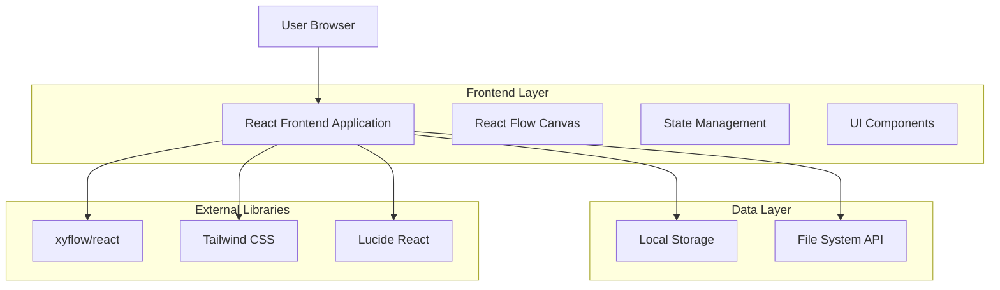
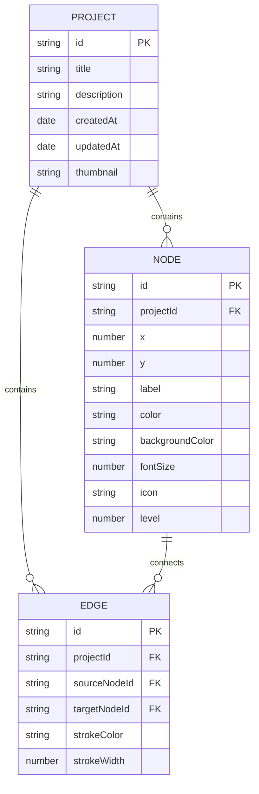

# 思维导图应用技术架构文档

## 1. Architecture design



## 2. Technology Description

- Frontend: React@18 + TypeScript + @xyflow/react + Tailwind CSS + Vite
- State Management: React Context + useReducer
- Icons: Lucide React
- Build Tool: Vite
- Storage: Local Storage + File System API

## 3. Route definitions

| Route | Purpose |
|-------|---------|
| / | 项目管理页面，显示所有思维导图项目列表 |
| /editor/:projectId | 主编辑页面，思维导图编辑器界面 |
| /export/:projectId | 导出页面，设置导出选项和预览 |

## 4. API definitions

### 4.1 Core Types

```typescript
// 节点数据类型
interface MindMapNode {
  id: string;
  type: 'mindmap';
  position: { x: number; y: number };
  data: {
    label: string;
    color: string;
    backgroundColor: string;
    fontSize: number;
    icon?: string;
    level: number;
  };
}

// 连接线数据类型
interface MindMapEdge {
  id: string;
  source: string;
  target: string;
  type: 'smoothstep';
  style: {
    stroke: string;
    strokeWidth: number;
  };
}

// 项目数据类型
interface Project {
  id: string;
  title: string;
  description?: string;
  nodes: MindMapNode[];
  edges: MindMapEdge[];
  createdAt: Date;
  updatedAt: Date;
  thumbnail?: string;
}

// 导出配置类型
interface ExportConfig {
  format: 'png' | 'pdf' | 'json';
  quality: number;
  width: number;
  height: number;
  backgroundColor: string;
}
```

### 4.2 Local Storage API

```typescript
// 保存项目
const saveProject = (project: Project): void => {
  localStorage.setItem(`mindmap_${project.id}`, JSON.stringify(project));
}

// 获取项目
const getProject = (projectId: string): Project | null => {
  const data = localStorage.getItem(`mindmap_${projectId}`);
  return data ? JSON.parse(data) : null;
}

// 获取所有项目
const getAllProjects = (): Project[] => {
  const projects: Project[] = [];
  for (let i = 0; i < localStorage.length; i++) {
    const key = localStorage.key(i);
    if (key?.startsWith('mindmap_')) {
      const data = localStorage.getItem(key);
      if (data) projects.push(JSON.parse(data));
    }
  }
  return projects.sort((a, b) => new Date(b.updatedAt).getTime() - new Date(a.updatedAt).getTime());
}

// 删除项目
const deleteProject = (projectId: string): void => {
  localStorage.removeItem(`mindmap_${projectId}`);
}
```

## 5. Data model

### 5.1 Data model definition



### 5.2 Data Definition Language

由于使用 Local Storage 作为数据存储，不需要传统的 DDL 语句。数据结构通过 TypeScript 接口定义：

```typescript
// 项目初始化数据
const createNewProject = (): Project => ({
  id: generateId(),
  title: '新建思维导图',
  description: '',
  nodes: [
    {
      id: 'root',
      type: 'mindmap',
      position: { x: 400, y: 300 },
      data: {
        label: '中心主题',
        color: '#1F2937',
        backgroundColor: '#3B82F6',
        fontSize: 16,
        level: 0
      }
    }
  ],
  edges: [],
  createdAt: new Date(),
  updatedAt: new Date()
});

// 默认节点样式配置
const defaultNodeStyles = {
  level0: { backgroundColor: '#3B82F6', color: '#FFFFFF', fontSize: 18 },
  level1: { backgroundColor: '#10B981', color: '#FFFFFF', fontSize: 16 },
  level2: { backgroundColor: '#F59E0B', color: '#FFFFFF', fontSize: 14 },
  level3: { backgroundColor: '#EF4444', color: '#FFFFFF', fontSize: 12 }
};

// 导出默认配置
const defaultExportConfig: ExportConfig = {
  format: 'png',
  quality: 1.0,
  width: 1920,
  height: 1080,
  backgroundColor: '#FFFFFF'
};
```